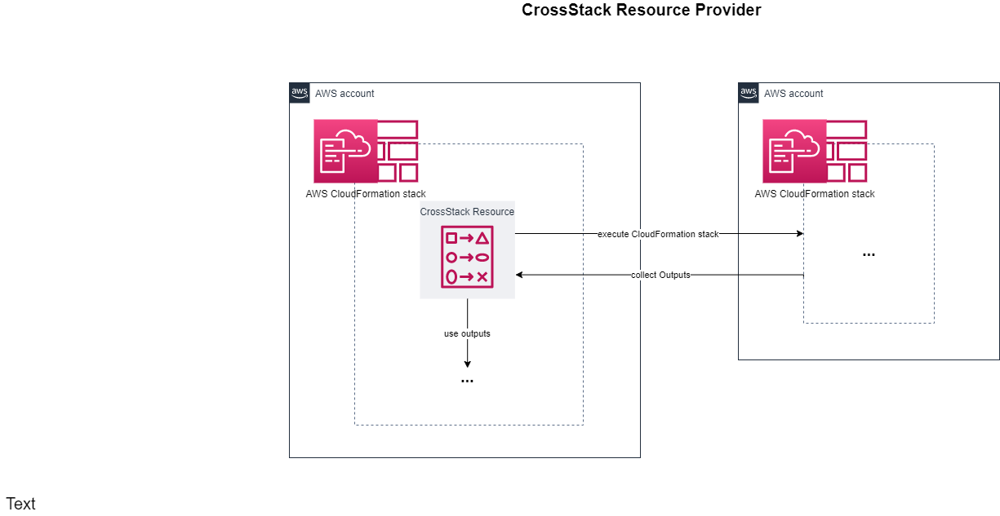

# Introduction

**SPRT::CrossStack::Executor** helps in deploying CrossAccount/CrossRegional CloudFormation stacks.

In comparison to CloudFormation StackSets, it offers the following additional functionalities:
* Retrieving CloudFormation Outputs inside the "master" CloudFormation.
* Use these Outputs as input for other Resources and configure follow-up Resources accordingly.
* Start installations of different CloudFormation stacks from one single "master" CloudFormation stack.

In comparison to CloudFormation nested Stacks, it offers the following additional functionalities:
* The solution works Cross-Region and
* Cross-Account



Some real world examples include:
* Creation of VPC inside AWS accounts and attaching them to a centralized AWS Transit Gateway.
* Collecting Route53 RecordSet entries for different accounts.
* Creation of SCPs with _Accept_ for only well known ResourceIds from the CloudFormation stack leveraging CrossStack's deployments. 


# Usage

## Requirements

CrossStack is always assuming another role. Please find a quickstart role to deploy inside _samples/cross-account-access-role.yml_


## Syntax

```yml
Type: SPRT::CrossStack::Executor
Properties:
  AccountId: String
  AssumeRoleName: String
  AssumeRolePath: String
  CfnCapabilities:
  - Array
  CfnParameters:
    StackParameters
  CfnStackName: String
  CfnTemplate: String
  CfnTemplateUrl: String
  LogLevel: Number
  Region: String
```

StackParameters Object
```yml
ParameterKey1: ParamterValue1
...
ParameterKeyN: ParameterValueN
```

## Properties

AccountId

> Defines the AWS Account ID where to deploy the defined CloudFormation template.
>
> _Required_: Yes
> 
> _Type_: String
> 
> _Pattern_: \d{12}
> 
> _Update allowed_: No


AssumeRoleName

> Role name to assume for CrossStack's installations in different AWS accounts. 
>
> _Required_: Yes
>
> _Type_: String
> 
> _Update allowed_: Yes


AssumeRolePath

> Role path to assume for CrossStack's installations in different AWS accounts. 
>
> _Required_: No
>
> _Default_: /
>
> _Type_: String
> 
> _Update allowed_: Yes


CfnCapabilities:

> Capabilities for Stack to create/update.
>
> _Required_: No
>
> _Default_: []
>
> _Type_: List
> 
> _Possible values_: [All known CloudFormation capabilities](https://docs.aws.amazon.com/AWSCloudFormation/latest/APIReference/API_CreateStack.html) (CAPABILITY_IAM, CAPABILITY_NAMED_IAM, CAPABILITY_AUTO_EXPAND)
>
> _Update allowed_: No


CfnParameters

> Parameters for CloudFormation stack.
>
> _Required_: No
>
> _Default_: {}
>
> _Type_: Object
> 
> _Update allowed_: Yes


CfnStackName

> CloudFormation Stack name for CrossStack's installation.
>
> _Required_: Yes
>
> _Type_: String
> 
> _Update allowed_: No


CfnTemplate

> CloudFormation Stack template for CrossStack's installation.
> You must include either CfnTemplateUrl or CfnTemplateBody in a Stack, but you cannot use both.
>
> _Required_: No
>
> _Type_: String
> 
> _Update allowed_: Yes

CfnTemplateUrl

> CloudFormation Stack template S3 url for CrossStack's installation.
> You must include either CfnTemplateUrl or CfnTemplateBody in a Stack, but you cannot use both.
>
> _Required_: No
>
> _Type_: String
> 
> _Update allowed_: Yes


LogLevel

> Internal logging level for CrossStack's CloudWatch logs. Mostly used for debugging purposes.
>
> _Required_: No
>
> _Default_: 30
>
> _Type_: Number
> 
> _Allowed values_: One of [Python's defined Logging Levels](https://docs.python.org/3/library/logging.html#logging-levels).
>
> _Update allowed_: Yes


Region

> Defines the AWS Region where to deploy the defined CloudFormation template.
>
> _Required_: Yes
> 
> _Type_: String
>
> _Possible values_: One of [AWS service endpoints](https://docs.aws.amazon.com/general/latest/gr/rande.html)
>
> _Update allowed_: No


## Return values

**Ref**

> _Nothing_


**Fn::GetAtt**

CfnStackId

> Internal ID of CrossStackResource.
>
> _Example_: teststack-123456789012-eu-central-1


CfnStackOutput1, ..., CfnStackOutput9

> Up to 9 variables can be retrieved from CrossStack installations. 
>
> Example: SomeVariableValueFromCrossStackExecution


# Examples

**Create an S3 bucket**

The following example creates and S3 bucket on another AWS account and region.
The output variables are catched inside the execution stack and can be used for additional purposes.

```yml
Resources:
  TestResource:
    Type: SPRT::CrossStack::Executor
    Properties:
      AccountId: 123456789012
      Region: eu-central-1
      AssumeRoleName: sprt-crossstack-role
      LogLevel: 10
      CfnCapabilities:
      - CAPABILITY_NAMED_IAM
      CfnStackName: my-first-test-stack
      CfnParameters:
        CreatedByTag: CrossStackExecutor
      CfnTemplate: |
        AWSTemplateFormatVersion: 2010-09-09
        Parameters:
          CreatedByTag:
            Type: String
        Resources:
          S3Resource:
            Type: AWS::S3::Bucket
            Properties:
              BucketName: !Sub "some-bucket-name-${AWS::AccountId}-${AWS::Region}"
              Tags:
              - Key: CreatedBy
                Value: !Ref CreatedByTag
        Outputs:
          S3BucketArn:
            Value: !GetAtt S3Resource.Arn

Outputs:
  ExampleOutput:
    Description: Example output for S3 Bucket ARN from child execution
    Value: !GetAtt TestResource.CfnStackOutput1
```


# Development

## Setup environment

**Pre-requisites:**
* Development was done via Cloud9 environment on an Amazon Linux system
* Initial setup followed the steps from [github's cloudformation-cli README](https://github.com/aws-cloudformation/cloudformation-cli)

**Full Resource Provider update and deployment of s3-example:**
```sh
$ cfn generate
$ cfn validate
$ cfn submit --set-default
$ aws cloudformation deploy --template-file samples/s3-example.yml --stack-name crossstack-resource-provider-test
```

## Debugging and feature enhancement

* First of all: Take care to set Parameter _LogLevel: 10_, as it adds helpful information about processed handlers and parameters.
* Resource handlers are separated into different files for better readability. They can be found inside *src/sprt_crossstack_executor/sub_handlers/**


# Q&A

_Q: Are all CloudFormation Create/Update Stack parameters supported?_  
A: Only a subset is implemented right now. Nevertheless, it's easy to add additional ones inside the handler functionalities.

_Q: Why are there only nine predefined Output variables from CrossStack's execution?_  
A: CloudFormation resource provider doesn't allow for dynamic output variables so far. Therefore these predefined set of variables acts as a workaround.

_Q: How is this resource tested?_  
A: Unfortunately the Python contract tests aren't running as of now (@see github issue [#112](https://github.com/aws-cloudformation/cloudformation-cli-python-plugin/issues/112)).
Therefore tests were done with the provided example deployment _samples/s3-examples.yml_.

_Q: What does the name SPRT stand for?_  
A: That's an easy one: *S*uper *P*eculiar *R*esource *T*ype.
